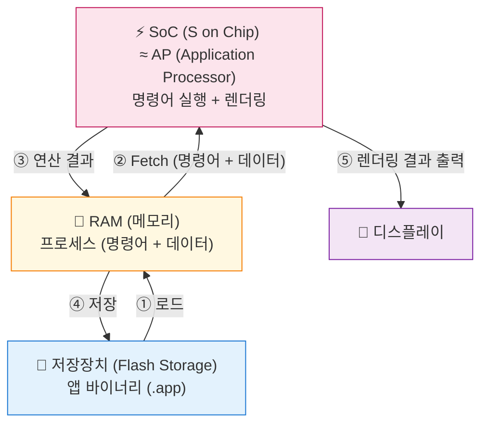

+++
title = '[Apple Platforms] iOS 개발자 기술 인터뷰 준비 1'
date = 2026-01-01T00:00:00+09:00
draft = true
tags = ["iOS", "Apple Platforms"]
categories = ["Apple Platforms"]
summary = ""
+++

## Motivation
- iOS 직무 기술 면접을 보게 되었다. 인터뷰에서 물어볼법한 질문 리스트에 대해 답을 달아보면서 기술 지식들을 정리해보려고 한다.

## Overview
- **컴퓨터 시스템 기초** ✅
- **프로세스와 스레드** ✅
- **메모리관리** ✅
- **네트워크** ✅
- **이미지와 파일** ✅
- **보안** ✅
- 알고리즘과 자료구조
- 운영체제
- 데이터베이스
- 디자인 패턴
- 직렬화
- 동시성
- Swift 기초
- Swift, iOS중급
- iOS 고급
- iOS 고급+
- 리더십 및 아키텍처

## Q&A + beef up
### 컴퓨터 시스템 기초

1. 🔵👀컴퓨터 시스템에서 CPU, RAM, 저장 장치의 역할과 이들이 어떻게 상호 작용하는지 설명해주세요. 
   1.1. 앱을 실행할 때 이 구성 요소들이 어떤 순서로, 어떻게 상호작용하여 앱 화면을 보여주게 되나요? 
   1.2. RAM이 부족하면 iOS 시스템은 어떤 동작을 할까요? 이것이 앱 개발 시 왜 중요할까요? 
   1.3. CPU 속도, RAM 용량, 저장 장치 속도 중 어떤 것이 앱의 '체감 속도'에 가장 큰 영향을 미칠 수 있을까요? 이유와 함께 설명해주세요. 
   ❓1.4. iOS의 A-시리즈 칩셋에서 CPU와 GPU가 메모리를 공유하는 Unified Memory Architecture가 앱 개발에 미치는 영향은 무엇인가요? 
   ❓1.5. Metal 프레임워크를 사용할 때 CPU와 GPU 간의 데이터 전송을 최적화하는 방법은 무엇인가요?

	- 저장 장치의 역할
		- CPU (중앙처리장치): 컴퓨터의 뇌, 연산과 명령어 처리. 프로그램의 논리적 판단과 수학적 계산. 데이터 저장은 불가하고 **데이터 처리**만.
		- 주기억장치(RAM): 작업 책상, CPU가 **작업중인 데이터와 프로그램 임시로 저장**
		- 프로세스 (프로그램이 메모리에 올라온 상태), 캐시가 다뤄지고 보조기억장치(SSD, HDD)에 장기 저장된 것들 가져옴.
	- 컴퓨터 시스템 상호작용
		- 사용자가 프로그램 실행
		- 저장장치에서 프로그램 파일 읽어옴
		- 프로그램에 RAM에 로드
		- CPU가 RAM에서 명령어와 데이터 가져와서 처리 
			- Code 영역에서 명령어, Data Heap Stack 영역에서 데이터
		- 처리 결과는 RAM에 저장
		- 필요에 따라 저장장치에 저장
	``` mermaid
	flowchart TB
	    CPU["⚡ CPU (프로세서)<br/>연산 수행"]
	    RAM["🧠 RAM (메모리)<br/>실행 중인 앱 데이터"]
	    SSD["💾 저장장치 (SSD)<br/>앱 바이너리, 사진, 문서"]
	    
	    RAM -->|"② 데이터, 명령어 가져오기"| CPU
	    CPU -->|"③ 연산 결과"| RAM
	    SSD -->|"① 로드 (프로그램 -> 프로세스)"| RAM
	    RAM -->|"④ 저장 (optional)"| SSD
	    
	    style CPU fill:#fce4ec,stroke:#c2185b
	    style RAM fill:#fff8e1,stroke:#f57c00
	    style SSD fill:#e3f2fd,stroke:#1976d2
	```
	1. 앱 실행시 상호작용

- iPhone의 경우 저장장치는 Flash Storage
- AP는 CPU, GPU, NPU 등이 하나로 통합된 **SoC (System on a Chip)**

	```swift
	// ① 사용자가 앱 아이콘 탭
	//    → Hard Disk에서 앱 바이너리 로드 → Memory에 프로세스 생성
	
	// ② ~ ⑤ CPU가 명령어 순차 실행
	@main
	struct MyApp: App {
	    var body: some Scene {
	        WindowGroup {
	            ContentView()  // ⑥ 화면 출력
	        }
	    }
	}
	```
	
	2. RAM 부족에 따른 iOS 시스템 동작
		1. RAM 부족 감지
		2. iOS 메모리 압축 시도 (CPU 부하 증가)
		3. 여전히 부족 → didReceiveMemoryWarning() 호출 (앱에게 알리기 전)
		4. 여전히 부족 → 앱 강제 종료 (Jetsam) (백그라운드 앱 종료 -> 포그라운드 앱 종료)
			- 백그라운드 앱 종료 우선 순위
				1. 메모리 사용량 많은 앱
				2. 마지막 사용 시간 오래된 앱
				3. 우선순위 낮은 앱
		- 단계 - 시스템 동작 - 개발자 대응
			- 🟢 Normal - 정상 운영
			- 🟡 Warning - `didReceiveMemoryWarning()` 호출 - 캐시 정리
			- 🟠 Critical - 백그라운드 앱 강제 종료 - 필수 데이터만 유지
			- 🔴 Jetsam - 현재 앱도 강제 종료 - 상태 저장 필수
		- 중요한 이유: 사용자 경험 저하
			- 작성중인 내용 소실
			- 로그인 풀림
			- 로딩 대기 ...
		- 개발자가 해야할 일
			- 메모리 경고 대응 -> 캐시 정리 코드
			- 메모리 누수 (Jetsam 가속화) 방지 -> [weak self] 사용
			- 앱 강제 종료 가능 -> 상태 저장

	```swift
	// didReceiveMemoryWarning() 호출 시 캐시 정리 
	override func didReceiveMemoryWarning() {
	super.didReceiveMemoryWarning() 
	imageCache.removeAll() thumbnails = nil 
	}
	
	// ❌ 순환 참조 → 메모리 누수
	closure = { self.doSomething() }
	
	// ✅ 약한 참조로 해결
	closure = { [weak self] in
	self?.doSomething()
	}
	
	// 앱이 백그라운드로 갈 때 상태 저장 
	func sceneDidEnterBackground(_ scene: UIScene) { 
	saveUserDraft() // 작성 중인 내용 저장 
	}
	```

	3. RAM 용량이 앱의 체감 속도에 가장 큰 영향을 줄 것 같음
		- RAM 부족하면 백그라운드 앱이 종료되기 때문.
		- CPU가 느리면 반응(연산)이 느리고, 저장 장치가 느리면 앱 실행과 데이터 로딩이 느리기 때문
		🐮 iOS 특성상 RAM 용량이 중요하지만 **상황, 단계**에 따라 다름
			- **앱 최초 실행** - 저장 장치 속도 - 바이너리 로딩 시간
			- **UI 반응성** - CPU 속도 - 터치 이벤트, 레이아웃 계산
			- **멀티태스킹** - RAM 용량 - 앱 상태 유지, 재시작 방지
			- **사진/영상 편집** - CPU + RAM - 연산 + 대용량 데이터 처리
			- **게임** - CPU + GPU - 실시간 렌더링, 물리 연산
	4. ❓
	5. ❓

---
2. CPU와 메모리 간의 데이터 교환은 어떻게 이루어지나요? 
   2.1. 데이터 교환 속도를 높이기 위해 컴퓨터 시스템에는 어떤 장치들이 사용되나요? 
   2.2. 버스(Bus)란 무엇이며, 어떤 종류가 있나요?
   2.3. CPU와 RAM 외에 버스를 통해 연결되는 다른 장치들은 무엇이 있을까요?

	- 버스를 통해서
		```mermaid
		flowchart LR
		    CPU["CPU"]
		    
		    subgraph BUS["시스템 버스"]
		        ADDR["주소 버스<br/>(CPU → RAM)<br/>읽기/쓰기 대상 주소 전달"]
		        DATA["데이터 버스<br/>(CPU ↔ RAM)<br/>실제 데이터 전송 (양방향)"]
		        CTRL["제어 버스<br/>(CPU → RAM)<br/>읽기/쓰기 명령 전달"]
		    end
		    
		    RAM["RAM"]
		    
		    CPU --> ADDR
		    CPU <--> DATA
		    CPU --> CTRL
		    
		    ADDR --> RAM
		    DATA <--> RAM
		    CTRL --> RAM
		    
		    style CPU fill:#fce4ec,stroke:#c2185b,stroke-width:2px
		    style RAM fill:#fff8e1,stroke:#f57c00,stroke-width:2px
		    style BUS fill:#e3f2fd,stroke:#1976d2,stroke-width:2px
		```
	- 구조
	```mermaid
		flowchart TB
    subgraph FAST["빠름 / 용량 작음"]
        REG["CPU 레지스터"]
    end
    
    subgraph MID["CPU"]
	    L1["L1 캐시"]
        L2["L2 캐시"]
        L3["L3 캐시"]
    end
    
    subgraph SLOW["느림 / 용량 큼"]
        RAM["RAM"]
    end
    
    REG <--> L1
    L1 <--> L2
    L2 <--> L3
    L3 <--> RAM
    
    style FAST fill:#ffcdd2,stroke:#c62828
    style MID fill:#fff8e1,stroke:#f57c00
    style SLOW fill:#e3f2fd,stroke:#1976d2
    style REG fill:#ffcdd2
    style L1 fill:#ffe0b2
    style L2 fill:#fff8e1
    style L3 fill:#e8f5e9
    style RAM fill:#e3f2fd
	```
	- 🐮 캐시 메모리와 메모리 캐싱은 다르고, 캐싱의 대상도 다름!
		- **캐시 메모리**는 CPU 내부 하드웨어 - RAM 데이터 저장
		- **메모리 캐싱**은 RAM에 데이터를 임시 저장하는 소프트웨어 기법 - 저장장치와 네트워크 데이터 저장

	1. 속도 차이는 **캐시 메모리**로 완충
		- **캐시 메모리**(L1/L2/L3)가 CPU-RAM 속도 차이 완충
		- **DMA**와 **버퍼**가 I/O 속도 향상
	2. 버스의 종류: 주소, 데이터, 제어
	3. 시스템 버스와 연결되는 것들
		- CPU
		- RAM
		- GPU
		- I/O
		- 저장장치
		- 네트워크 장치

---
3. 🔵캐시 메모리의 개념과 역할에 대해 설명해주세요. #거의이해
   3.1. 캐시 히트(Cache Hit)와 캐시 미스(Cache Miss)는 무엇이며, 성능에 어떤 영향을 미치나요? 
   3.2. 캐시의 지역성(Locality) 원리에 대해 설명해주세요. 
    3.2.1. 시간적 지역성과 공간적 지역성의 구체적인 예를 코드로 설명해주실 수 있나요?
    3.2.2. 지역성 원리를 잘 활용하지 못하게 작성된 코드는 어떤 성능 문제를 일으킬 수 있을까요?

	- 캐시 메모리: 실제 메모리와 CPU 사이에서 빠르게 전달을 위해서 미리 데이터들을 저장해두는 좀더 빠른 메모리
	- 캐시: 자주 사용하는 데이터들을 빠르게 가져와서 사용할 수 있도록 데이터들을 저장해놓은 저장소.
	1. 캐시 히트란, 해당 데이터가 캐싱이 되어있어서 찾아서 가져올 수 있는 상태 캐시 미스란, 해당 데이터가 캐싱이 되어있지 않아서 데이터를 요청하거나 캐싱을 해야하는 상태. 기존에 사용했던 데이터지만 캐시 미스일 경우 데이터를 요청해야해서 시간 코스트가 발생한다.
		- 블록 사이즈가 커지면 캐시의 Hit율도 올라간다. 그렇다고 해서 무작정 블록 사이즈를 키우는 것만으로는 그 효율성을 높일 수는 없다. 이에 따라 몇 가지 요소를 고려하여 설계해야 한다. 설계의 목표는 Hit율을 높이고 최소의 시간에 데이터를 전달 하는 것이다. Hit 실패시에 다음 동작을 처리하는데 있어서 시간을 최소화하는 것이 중요하며 데이터의 일관성 유지해서 이에 따른 오버헤드 최소화해야 한다.
	2. 지역성의 원리는 두 가지로 나뉨, 
		- 공간 지역성은 같은 캐시에 캐싱되어있는 데이터들은 함께 사용될 경향성이 있다는 원리. ex 배열의 [0]다음 [1] 함께 쓰일 가능성 높음. 
		- 시간 지역성은 한 번 참조된 주소의 내용은 곧 다음에 다시 참조된다는 특성 ex for, while 반복문(for, while)에서 루프 본문의 명령어나 변수(예: 배열 요소나 카운터 변수)가 매 반복마다 동일하게 재사용되기 때문
			예를 들어,  for i in 0..<100 { sum += array[i] } 처럼 sum 변수나 루프 명령은 메인 메모리 대신 캐시에 머무르며 빠르게 접근됩니다.
이 패턴으로 “방금 썼던 데이터가 곧 다시 필요하다”는 특성이 나타납니다.
		- 각 구성 요소 위치
			- sum 변수: 루프 내 지역 변수(local variable)로, value type(Int 등)이므로 스택에 할당됩니다. 반복마다 재사용되며 빠른 접근이 가능해 시간적 지역성을 보입니다.
			- 루프 명령(for 루프 코드): 코드(Code) 영역에 저장된 읽기 전용 기계어로, 실행 중 CPU가 자주 fetch해 캐시에 머무릅니다.
			- i 변수: 루프 카운터로 sum과 마찬가지로 스택에 할당.
			- array: 배열 객체는 **힙(Heap)**에 할당되지만, 루프에서 순차 접근(arrayi)으로 공간적 지역성도 활용
			- 캐시 머무름 이유: 스택과 코드 영역은 접근 패턴이 예측 가능해 CPU 캐시(L1 등)에 잘 적합합니다. sum처럼 “반복 재참조”되는 데이터가 캐시 히트로 메인 메모리 대신 빠르게 로드됩니다
		실제 활용 예시
			- 변수 재사용: 루프 내 스칼라 변수(sum)는 좋은 시간적 지역성을 보입니다.
			- 함수 호출: 재귀나 반복 호출 시 스택 데이터가 자주 재접근됩니다.
Swift/iOS 개발에서 ARC나 캐싱 전략(예: NSCache) 설계 시 이 원리를 고려해 메모리 효율을 높입니다.
		2. ❓
		3. 여러개의 데이터가 필요할 때 분산된 캐시에 저장이 되어있다면 데이터를 찾아야하는 시간 코스트가 발생한다.
		- 각 캐시 위치 정리
			- CPU 캐시: CPU 다이 내부에 SRAM으로 구현 (L1/L2/L3). CPU와 RAM 간 속도 차 완화.
			- 메모리 캐시: DRAM(RAM) 영역 일부를 OS가 파일/디스크 데이터 버퍼로 사용 (페이지 캐시).
			- 디스크 캐시: 디스크 컨트롤러 내부의 DRAM이나 SLC 영역. SSD/HDD NAND 플래시 속도 보완
![[Pasted image 20260203101742.png]]


4. #정리 #힘빼자 CPU 아키텍처의 종류(예: ARM, x86)와 각 특징에 대해 설명해주세요.
   👀4.1. iOS 기기는 주로 어떤 아키텍처를 사용하며, 그 이유는 무엇일까요? 
   👀4.2. iOS 시뮬레이터는 보통 어떤 아키텍처에서 실행되며, 실제 기기와 어떤 차이가 있을까요? 이것이 개발에 어떤 영향을 미칠 수 있나요?
	
	- 분류 기준: 명령어 집합 구조(ISA)
		- CISC: 복잡한 명령어를 사용해 하나의 명령으로 여러 연산을 처리
		- RISC: 단순한 고정 길이 명령어로 빠른 실행 강조. 전력 효율이 높아 모바일에 적합
	- 대표 아키텍처:
		- **x86/x86-64 (CISC)**: 가변 길이 명령어, PC/서버 중심 ex) Intel, AMD
		- **ARM (RISC)**: 저전력, 고정 길이 명령어, 모바일 중심 ex) Apple M 시리즈, Qualcomm Snapdragon
		- RISC-V (RISC): 오픈 소스 ,단순 명령어 ex) 임베디드 시스템
		- MIPS (RISC): 고정 길이, 병렬 처리 최적화 ex) 네트워킹 장비
		- 기타: VLIW, EPIC은 병렬 처리를 강조하나 상용화가 제한적. 하이브리드도 있음(CISC+RISC -> Intel Alder Lake)
	1. 🐮 iOS 아키텍처는 주로 ARM (특히 arm64)기반의 Apple Silicon (A, M 시리즈)
		- 사용 아키텍처
			- ARM(RISC 기반) 아키텍처 채택 iOS arm64 명령어 집합을 지원
			- Apple이 ARM 라이선스를 바탕으로 커스텀 설계해 고성능 구현.
		- 채택 이유
			- 저전력 소비와 고성능 균형을 위해 RISC 구조의 ARM 선택
			- 배터리 효율 향상: 모바일 기기에서 장시간 사용 가능.
			- SoC 통합 최적화: 카메라, Neural Engine 등 하드웨어와 연계 쉬움.
			- 애플 생태계 통합: iOS 앱과 Mac 간 호환성 강화(Rosetta 등).
	2. 🐮Xcode iOS 시뮬레이터는 호스트 Mac 아키텍처에 따름
		- Apple Silicon Mac의 arm64 또는 Intel Mac의 x86_64에서 실행
		- 실제 iOS 기기의 ARM64와 다름.
		- Simulator는 시뮬레이션(호스트 코드로 UI/동작 흉내) 방식으로, 에뮬레이션이 아닌 host 자원을 직접 사용
		- 실제 기기와 차이
			- Simultor
				- 아키텍처는 호스트 Mac을 따름
				- Mac 자원으로 빠른 성능
				- 하드웨어 카메라/센서/푸시 미지원
				- 백그라운드 제한적 처리
				- 파일 시스템 대소문자 구분
			- 실제 기기
				- arm64 아키텍처
				- 제한적 메모리/CPU로 느림
				- 하드웨어 전체 지원
				- 백그라운드 실제 iOS 동작
				- 파일 시스템 APFS
		- Simulator 특징
			- 빠른 프로토타이핑·UI 디버깅에 유용
			- 실제 기기에서만 드러나는 성능/하드웨어 이슈(메모리 부족, 센서 오류)로 릴리스 버그 발생 가능
			- 따라서 핵심 기능(네트워크, ML, 배터리)은 실제 기기 테스트 필수
			- XCFramework 등 다중 아키텍처 지원이 필요

5. #힘빼자 iOS 기기에서 사용되는 AP(Application Processor)의 특징과 역할에 대해 설명해주세요. 
   5.1. iOS AP에는 CPU 외에 어떤 중요한 구성 요소들이 포함되어 있으며, 이들이 앱 성능에 어떻게 기여하나요? 
   5.2. SoC(System on Chip)의 개념은 무엇인가요? 
   5.2.1. SoC 설계가 모바일 기기에서 중요한 이유는 무엇일까요?
	- 잘 모르겠다
		- ❓
		- ❓
			- ❓

6. #보자 iOS 앱이 백그라운드로 전환될 때 메모리 부족으로 종료되는 이유는 무엇인가요? 
   6.1. iOS의 메모리 압력(Memory Pressure) 단계는 어떻게 구분되며, 각 단계에서 시스템이 취하는 조치는 무엇인가요?6.1.1. Normal, Warning, Urgent, Critical 각 단계에서 시스템이 자동으로 수행하는 작업6.1.2. 개발자가 각 단계에서 취해야 할 조치의 우선순위는?
   6.2. 백그라운드 앱이 종료되는 우선순위는 어떻게 결정되나요? 
   6.3. 앱이 백그라운드에서 종료되기 전에 받을 수 있는 알림은 무엇이며, 이때 어떤 작업을 해야 하나요? 
   6.4. 백그라운드에서도 계속 실행이 허용되는 앱 유형은 어떤 특별한 권한을 사용하나요?
	- 잘 모르겠다
		1. ❓
			1. ❓
			2. ❓
		2. ❓
		3. ❓
		4. ❓

### 프로세스와 스레드
7. #보자 프로세스와 스레드의 차이점, 그리고 iOS에서의 프로세스와 스레드 관리 방법에 대해 설명해주세요. 
   7.1. 하나의 앱 내에서 여러 프로세스를 사용하는 경우가 흔한가요? 아니라면 왜 스레드를 주로 사용할까요? 7.2. 멀티스레딩이 필요한 이유는 무엇인가요? 
   7.3. Main 스레드에서 시간이 오래 걸리는 작업을 처리하면 어떤 문제가 발생할 수 있나요? 구체적인 예를 들어 설명해주세요.

	- 프로세스는 프로그램이 실행되어 인스턴스에 올라와있는 것. 스레드는 실제 작업을 위한 큐
		- 프로세스 관리는 ? 스레드 관리는 GCD ?
			1. 하나의 앱 내에서 여러 프로세스를 사용하는 경우는 흔하지 않다. 스레드를 사용하는 이유는? 자원의 공유를 위해?
			2. 멀티 스레딩이 필요한 이유는 병렬 작업을 위해서이다. 특히 유아이 그리는 스레드와 백그라운드 스레드
			3. 뒤의 작업이 밀린다. 사용자가 오류로 생각할 수 있다. 시간이 너무 오래걸리면 사용자가 이탈할 수 있다. 예를 들어 프로필 이미지를 가져와서 띄우는 작업을 할 경우, 이미지가 오지 않았을 때 사용자는 오류라고 생각할 수 있다. 이를 위해서 기본 이미지와 이미지를 가져오는 중이라는 alert를 먼저 띄워놓고, 이미지 가져오는 로직을 비동기적으로 처리 한다. 이미지가 가져와지면 이미지를 업데이트 하는 방식을 사용할 수 있다.

8. #보자 iOS에서 GCD(Grand Central Dispatch)는 어떤 역할을 하나요? 8.1. GCD를 사용하지 않고 스레드를 직접 생성하고 관리할 때 발생할 수 있는 어려움은 무엇일까요? 8.2. GCD의 DispatchQueue 종류(Serial, Concurrent)와 사용 목적에 대해 설명해주세요. 8.3. iOS에서 앱이 백그라운드에서 실행될 때 스레드 우선순위는 어떻게 변경되나요? 8.4. Quality of Service (QoS) 클래스와 스레드 우선순위의 관계는 무엇인가요? 8.5. iOS의 런루프(RunLoop)와 스레드의 관계를 설명해주세요.
	- GCD는 스레드(큐)를 관리하는 역할을 한다.
		1. 작업을 스레드별로 분리해서 하기 어렵다.
		2. ❓
		3. ❓
		4. ❓
		5. ❓

### 메모리 관리

9. #보자 메모리 관리 기법 중 iOS에서 사용되는 방식과 그 특징에 대해 설명해주세요. 
   9.1. 자동 참조 카운팅(ARC)은 어떻게 동작하나요? 
   9.2. ARC가 자동으로 메모리를 관리해주는데, 개발자가 여전히 메모리 관리에 신경 써야 하는 이유는 무엇일까요? 
   9.3. 강한 참조(Strong Reference), 약한 참조(Weak Reference), 미소유 참조(Unowned Reference)는 각각 언제 사용해야 하나요? 예를 들어 설명해주세요. 
   9.4. 순환 참조(Retain Cycle)는 무엇이며, 어떻게 발생하고 해결할 수 있나요? 
    9.4.1. 클로저에서 [weak self] vs [unowned self] 선택 기준은 무엇인가요? 
    9.4.2. self가 nil이 될 수 있는 상황과 될 수 없는 상황을 어떻게 구분하나요? 
    9.4.3. guard let self = self 패턴의 장단점은 무엇인가요? 
   9.5 Garbage Collection과의 차이는 무엇인가요?
    9.5.1. ARC 방식이 GC 방식에 비해 갖는 장점과 단점은 무엇이라고 생각하시나요?
	- ARC
		1. 참조 수가 증가할 때 카운트를 더하고, 참조 수가 감소할 때 카운트를 빼서 카운트가 0이 되면 해당 인스턴스는 메모리에서 해제된다.
		2. ❓
		3. ❓
		4. ❓
			1. ❓
			2. ❓
			3. ❓
		5. ARC와 GC는 자체적으로 메모리 해준다는 공통점이 있지만 ~차이점이 있다 ❓❓❓

10. #힘빼자  iOS의 샌드박스(Sandbox) 개념과 역할, 그리고 앱 간 데이터 공유 방법에 대해 설명해주세요. 10.1. 샌드박스 때문에 앱 개발 시 겪을 수 있는 제약사항에는 어떤 것들이 있을까요? 10.2. URL 스킴(URL Scheme)을 이용한 앱 간 통신은 어떻게 이루어지나요? 10.2.1. URL 스킴을 사용할 때 보안적으로 고려해야 할 점은 무엇일까요? 10.3. 앱 그룹(App Group)을 활용하여 데이터 공유를 하는 방법은 무엇인가요? 10.3.1. 앱 그룹을 통한 데이터 공유는 어떤 종류의 데이터에 적합할까요? 대용량 파일 공유에도 적합할까요? 10.4. 앱 확장(App Extension)과 앱 그룹은 어떤 관계가 있나요?
	- 샌드박스는 앱을 하나의 공간 안에서~ 외부에 닫혀있고 내부에 열려있어서 자원 공유 가능.
		1. 데이터 가져오기?
		2. ❓
			1. ❓
		3. ❓
			1. ❓
		4. ❓

11. #보자 iOS에서의 메모리 구조와 관리 방식에 대해 자세히 설명해주세요. 11.1. 힙(Heap)과 스택(Stack)의 차이점은 무엇인가요? 11.2. 함수 호출 시 스택 메모리는 어떻게 사용되나요? 재귀 함수 호출 시 스택 메모리 사용은 어떻게 될까요? 11.3. Swift의 값 타입(Value Type)과 참조 타입(Reference Type)은 각각 힙과 스택 중 어디에 주로 할당되나요? 그 이유는 무엇일까요? 11.4. 값 타입과 참조 타입의 복사 방식(Copy-on-Write 포함) 차이에 대해 설명해주세요. 11.5. 스택 오버플로우(Stack Overflow)는 어떤 경우에 발생할 수 있나요?
	- 메모리는 4개의 영역: 코드, 데이터, 힙, 스택. 코드는 코드를 쓰는 영역, 데이터는 저장되어있는 데이터, 힙은 클래스나 요런것들 저장, 스택은 함수 호출할 때 쌓이는 영역
		1. 힙은 쌓인 순서 상관없이 해제되고 사라지고 스택은 쌓인 순서의 역순대로 해제됨 
		2. LIFO, 재귀 함수 호출 시 return하는 함수 스택부터 역순으로 해제됨.
		3. Reference는 힙, Value는 데이터?❓


### 네트워크

12. #정리 #힘빼자 사용자가 이미지를 업로드할 때 Wi-Fi에서는 실패하지만 LTE에서는 성공한다면, 어떤 네트워크 설정을 확인해야 할까요?
	- 🐮 Wi-Fi에서만 실패하면 **방화벽, 프록시, DNS, SSL 검사** 등 해당 네트워크 환경 문제를 먼저 의심
	- 체크리스트
		1. 방화벽 / 포트 차단
		2. 파일 크기 제한
		3. 프록시 설정
		4. DNS 문제
		5. SSL/TLS 인증서 문제
		6. 타임아웃 설정
	- 원인별 상세
		- 방화벽/포트 차단 - 회사/학교 Wi-Fi에서 특정 포트 차단 - 다른 Wi-Fi에서 테스트
		- 파일 크기 제한 - Wi-Fi 라우터나 프록시에서 업로드 크기 제한 - 작은 파일로 테스트
		- 프록시 설정 - Wi-Fi에 프록시 설정되어 있음 - 설정 → Wi-Fi → 프록시 확인
		- DNS 문제 - Wi-Fi DNS가 서버 주소 못 찾음 - 8.8.8.8로 DNS 변경 테스트
		- SSL 인증서 - 회사 Wi-Fi에서 SSL 검사로 인증서 문제 - Charles 등으로 트래픽 확인
		- 타임아웃 - Wi-Fi 속도 느려서 타임아웃 - 타임아웃 시간 늘려서 테스트
```swift
// 네트워크 에러 로깅
func uploadImage(data: Data) {
    URLSession.shared.uploadTask(with: request, from: data) { data, response, error in
        
        if let error = error as NSError? {
            print("에러 코드: \(error.code)")
            print("에러 도메인: \(error.domain)")
            print("에러 설명: \(error.localizedDescription)")
            
            // 주요 에러 코드
            switch error.code {
            case NSURLErrorTimedOut:
                print("타임아웃")
            case NSURLErrorCannotConnectToHost:
                print("서버 연결 불가")
            case NSURLErrorNetworkConnectionLost:
                print("연결 끊김")
            case NSURLErrorSecureConnectionFailed:
                print("SSL 연결 실패")  // ← Wi-Fi에서 자주 발생
            default:
                print("기타 에러")
            }
        }
    }.resume()
}
```

14. HTTP와 HTTPS의 차이점, 그리고 iOS에서의 보안 통신 방법에 대해 설명해주세요. 
    13.1. HTTPS를 사용하면 통신 내용이 안전하다고 말하는데, 정확히 무엇으로부터 보호되는 건가요? 
    13.2. iOS 앱에서 HTTP 통신을 시도하면 기본적으로 어떤 제한이 있나요? 이 제한을 우회하려면 어떻게 해야 하나요? 
    13.3. SSL/TLS의 동작 원리(Handshake 과정 포함)를 간략하게 설명해주세요. 
    13.4. 브라우저나 앱이 서버의 SSL/TLS 인증서가 유효한지 어떻게 확인할 수 있나요?
	- 차이점: HTTP는 일반, HTTPS는 보안
	- iOS에서의 보안 통신 방법: ❓
	1. ❓
	2. ❓
	3. ❓
	4. ❓

15. #보자 iOS 앱에서 URLSession으로 API를 호출할 때 OSI 7계층 중 어떤 계층들이 관여하며, 각 계층에서 무슨 일이 일어나나요? 14.1. Application Layer(7계층)에서 HTTP/HTTPS 요청은 어떻게 만들어지나요? 14.1.1. URLSession이 내부적으로 처리하는 작업들은 무엇인가요? 14.2. Transport Layer(4계층)에서 TCP 연결은 어떻게 관리되나요? 14.2.1. iOS에서 Keep-Alive 연결을 사용하는 이유와 설정 방법은? 14.3. Network Layer(3계층)에서 IP 주소는 어떻게 결정되나요? 14.3.1. iOS 기기가 Wi-Fi와 셀룰러 네트워크를 전환할 때 어떤 일이 일어나나요?
	- OSI 7계층
	- Application 계층 (7계층)
	1. ❓
		1. ❓
		2. ❓
			1. ❓
		3. ❓
			1. ❓

16. #힘빼자 HTTP 프로토콜의 특징과 HTTP/1.1과 HTTP/2의 차이점을 설명해주세요. 
    15.1. HTTP의 무상태(Stateless) 성질은 무엇이며, 어떻게 극복하나요? 
    15.1.1. 로그인 상태를 유지하기 위해 주로 어떤 기술들이 사용되나요? 
    15.2. HTTP/2에서 추가된 주요 기능은 무엇인가요? 
    15.2.1. HTTP/2의 멀티플렉싱(Multiplexing) 기능이 앱 성능에 어떤 이점을 줄 수 있나요? 15.3. HTTP/3에서 추가된 기능은 무엇인가요? 
    15.3.1. HTTP/3가 UDP 기반의 QUIC을 사용하는 이유는 무엇일까요?
	- 차이점: ❓
	1. ❓
		1. ❓
	2. ❓
		1. ❓
	3. ❓
		1. ❓

17. iOS에서 실시간 화상통화 앱을 만든다면 TCP와 UDP 중 어떤 프로토콜을 선택해야 하며, 그 이유는 무엇인가요? 16.1. 화상통화에서 약간의 패킷 손실과 지연 중 어떤 것이 더 치명적인가요? 16.2. WebRTC가 UDP를 기반으로 하는 이유는 무엇인가요? 16.3. iOS의 CallKit과 함께 사용할 때 고려해야 할 네트워크 설정은? 16.4. TCP를 사용하는 채팅 기능과 UDP를 사용하는 음성/영상 기능을 동시에 구현할 때 주의점은? 16.5. Network.framework를 사용한 커스텀 프로토콜 구현 시 고려사항은? 16.6. iOS에서 백그라운드 VoIP 소켓을 유지하는 방법과 제약사항은? 16.7. PushKit을 사용한 VoIP 푸시와 일반 푸시의 차이점은?
	- TCP
		- TCP는 양방향, UDP는 단방향
	1. 지연 ? 
	2. ❓
	3. ❓
	4. ❓
	5. ❓
	6. ❓
	7. ❓

18. REST API와 iOS에서의 네트워크 요청 및 응답 처리 방법에 대해 설명해주세요. 17.1. REST의 제약 조건(Stateless, Cacheable, Client-Server 등)에 대해 설명해주세요. 17.2. iOS에서 URLSession을 사용하여 네트워크 요청을 보내는 기본적인 과정은 무엇인가요? 17.3. URLSession 외에 iOS에서 네트워크 통신을 위해 사용할 수 있는 다른 방법들은 무엇이 있나요? 17.4. REST API에서 HTTP 메서드들의 차이점과 각각의 용도를 설명해주세요. 17.4.1. GET과 POST의 주요 차이점은 무엇인가요? 17.4.2. PUT과 PATCH 메서드의 차이점은 무엇인가요? 17.5. HTTP 상태 코드에 대해서 설명해주세요. 17.5.1. API 요청 실패 시, 4xx 에러와 5xx 에러의 의미 차이는 무엇이며, 앱에서는 각각 어떻게 대응하는 것이 좋을까요? 17.6. 서버로부터 받은 JSON 데이터를 Swift 객체로 변환하는 과정에 대해 설명해주세요. 17.6.1. Swift의 Codable 프로토콜은 어떻게 동작하나요? 17.6.2. JSON 키와 Swift 프로퍼티 이름이 다를 경우 어떻게 매핑하나요?
	- ❓
	1. ❓
	2. ❓
	3. ❓
	4. ❓
		1. ❓
		2. ❓
	5. ❓
		1. ❓
	6. ❓
		1. ❓
		2. Json Decoder

### 이미지와 파일

18. #보자  iOS에서 이미지 파일 포맷(PNG, JPEG, HEIC, WebP 등)과 각 포맷의 특징에 대해 설명해주세요. 18.1. PNG와 JPEG의 차이점은 무엇인가요? 18.2. 앱 UI 요소에는 주로 어떤 이미지 포맷을 사용하는 것이 좋을까요? 18.3. 사진과 같이 색상이 풍부한 이미지에는 왜 JPEG가 더 적합할 수 있나요? 18.4. HEIC 포맷의 장점은 무엇이며, iOS에서 주로 언제 사용되나요? 18.5. WebP 포맷의 특징과 장점은 무엇인가요? 18.6. 무손실 압축과 손실 압축의 차이는 무엇이며, 이것이 파일 크기와 이미지 품질에 어떤 영향을 미치나요? 18.7. iOS의 Asset Catalog에서 이미지가 어떻게 최적화되고 압축되나요? 18.8. @1x, @2x, @3x 이미지와 디바이스 픽셀 밀도의 관계는 무엇인가요? 18.9. iOS에서 이미지 메모리 사용량을 계산하는 방법은 무엇인가요? 18.10. 이미지를 다운샘플링하여 메모리를 절약하는 방법은 무엇인가요?
	- 파일 포맷
		- PNG
		- JPEG
		- HEIC
		- WebP
	1. PNG는 무손실, JPEG는 손실
	2. PNG
	3. 용량이 적어서
	4. 라이브포토?
	5. ❓
	6. ❓
	7. ❓
	8. ❓
	9. ❓
	10. ❓

19. #보자 ❤️ iOS에서 메모리 사이즈와 관련된 개념과 고려 사항에 대해 설명해주세요. 
    19.1. 메모리 정렬(Alignment)이 성능에 미치는 영향은 무엇인가요? 
    19.1.1. 메모리 정렬이 잘못되었을 때 발생할 수 있는 문제는 무엇인가요? 
    19.2. iOS 디바이스의 메모리 제약과 앱 메모리 제한에 대해 설명해주세요. 
    19.3. 앱의 메모리 사용량을 줄이기 위해 개발자가 할 수 있는 노력에는 어떤 것들이 있을까요? 
    19.4. 메모리 경고(Memory Warning)가 발생하면 어떤 조치를 취해야 하나요? 
    19.4.1. 메모리 경고를 받았을 때, 가장 먼저 확인하거나 시도해 볼 수 있는 조치는 무엇일까요? 
    19.5. Instruments의 Allocations, Leaks 도구를 사용해 본 경험이 있나요?
	- ❓
	1. ❓
		1. ❓
		2. ❓
		3. ❓
		4. ❓
			1. ❓
		5. 아니요. 개발자 세션에서 Instruments 사용한 것만 봤었지 실제로 사용해보지는 않았어요.

### 보안
20. #힘빼자 암호화와 보안의 기본 개념, 그리고 iOS 앱 보안을 위한 방안에 대해 설명해주세요. 
    20.1. 대칭키 암호화와 비대칭키(공개키) 암호화의 차이점과 각각의 장단점, 사용 예를 들어주세요. 
    20.2. 해싱(Hashing)은 무엇이며 암호화와 어떻게 다른가요? 
    20.3. 앱 내부에 민감한 정보를 저장해야 할 때, 어떻게 안전하게 처리해야 할까요? 
    20.4. 네트워크 통신 시 중간자 공격(Man-in-the-Middle Attack)은 무엇이며, 어떻게 방지하나요?
	- 
	1. 
	2. 암호화는 해독 가능한데, Hashing은 해독이 어려움. 해시 함수를 거쳐서 나온 해시 값이 같을 수도 있기 때문에.
	3. 
	4. 


### References 👀
- [Jercy's Interview Questions for iOS Developers](https://github.com/JeaSungLEE/iOSInterviewquestions?tab=readme-ov-file)
- [캐시(Cache)와 캐싱(Caching) 정리 from 10분 테크톡](https://readinggeneral.tistory.com/entry/캐시Cache와-캐싱Caching-정리-from-10분-테크톡)
- [1.2.2. 캐시 메모리 (Cache Memory) 개념, 기법](https://wikidocs.net/65523)