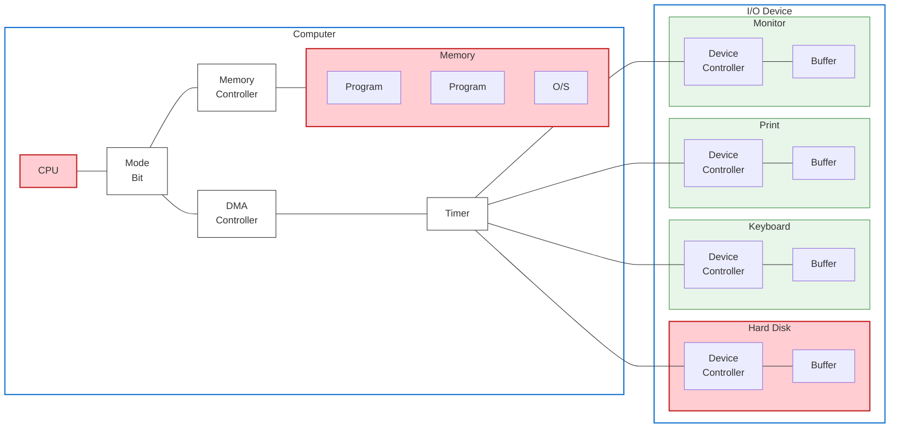
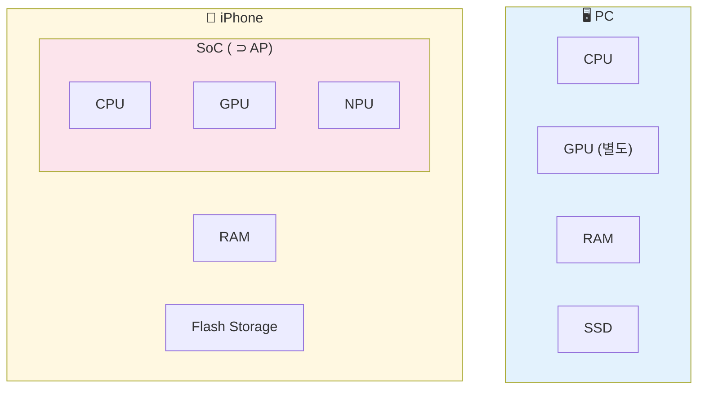
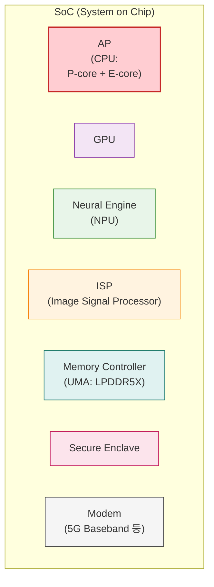

+++
title = '[Apple Platforms] SoC (System on a Chip)와 AP (Application Processor)'
date = 2026-02-03T00:00:00+09:00
draft = false
tags =  ["Apple Platforms", "CS"]
categories = ["Apple Platforms"]
summary = ""
+++

## Motivation
- 컴퓨터 구조를 공부하면서 스마트폰의 AP, SoC가 어떤 것에 대응되는지 궁금.

## Overview
- 컴퓨터의 CPU와 대응되는 것이 스마트폰의 AP, SoC ?
	- 하지만 컴퓨터 구조와 스마트폰에서의 컴퓨터 구조는 약간 다름
	- Apple Silicon이 SoC에 해당
- 목차
	- 컴퓨터 시스템 구조
	- SoC와 AP의 관계
	- Apple Silicon (Apple SoC)
	- iPhone 구조와 PC 구조의 대략적인 비교
	- Apple Silicon 구조
	- 정리

## 컴퓨터 시스템 구조

- 컴퓨터 시스템 구조:
	- 컴퓨터
	- I/O 디바이스
- 우리가 흔히 말하는 [컴퓨터 구조](https://wikidocs.net/111325) 핵심 요소:
	- CPU (중앙처리장치)
	- 메모리 (주기억장치)
	- 디스크 (보조기억장치)

## SoC와 AP의 관계
- **SoC (System on Chip)**
	- '시스템을 한 칩에 통합'
	- CPU/GPU/NPU(신경망)/ISP(카메라)/DSP/메모리 컨트롤러/보안 영역 같은 것들이 들어있는 **통합 칩 전체**
- **AP (Application Processor)**
	- '앱을 돌리는 메인 프로세서(연산 중심)'
	- 모바일 업계에서 보통 메인 칩(=사실상 SoC)을 AP라고 부르는 관행이 생김.
	- 특히 한국/스마트폰 맥락에서 “AP 뭐야?” 하면 대개 **그 폰의 메인 SoC**를 뜻함.
- 퀄컴 Snapdragon, 삼성 Axynos를 보통 “AP”라고도 부르지만, 기술적으로는 전형적인 SoC
- Apple은 문서/기술 설명에서 SoC라는 표현을 많이 사용하며, 공식 용어집에서 SoC를 “여러 구성요소를 단일 칩으로 통합한 IC”로 정의 [Apple 용어집 참고](https://support.apple.com/ko-kr/guide/security/sec93292bfa6/1/web/1)

## Apple Silicon (Apple SoC)
- Apple의 SoC
	- A-시리즈(iPhone)
	- M-시리즈(Mac)
- Application Processor, Secure Enclave 등 구성 요소를 SoC 일부로 설명

## iPhone 구조와 PC 구조의 대략적인 비교

## Apple Silicon 구조

## 정리
- 제품 스펙에서 **AP ≈ SoC** 로 흔하게 인식되지만
- 엄밀하게 구분하면 **AP는 SoC 중 앱/연산을 담당하는 중심 칩** (**SoC ⊃ AP**)
- Apple 플랫폼에서는 SoC 표현을 더 많이 사용

---

### References 👀
- [Apple SoC 보안](https://support.apple.com/ko-kr/guide/security/sec87716a080/web)
- [용어집](https://support.apple.com/ko-kr/guide/security/sec93292bfa6/1/web/1)